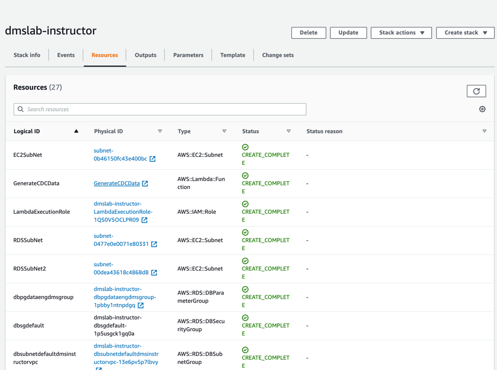
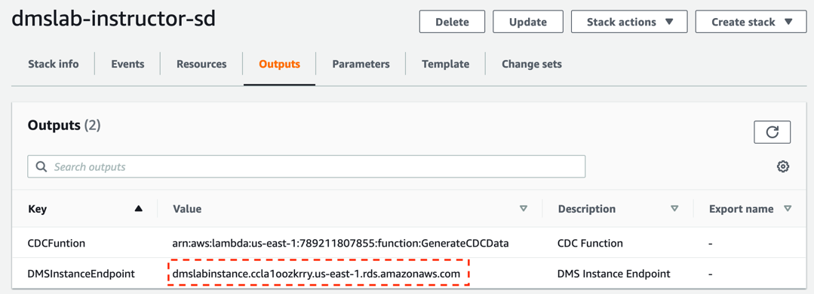
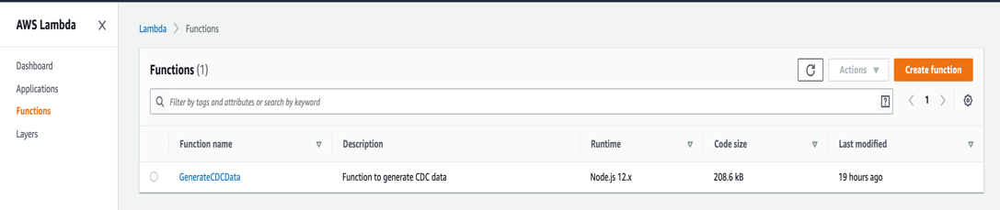

# Lake formation workshop

**NOTE: Please make sure the Postgres database is fully populated before proceed with the DMS lab. It takes 15 to 20 minutes to finish, after the stack is launched.**

- [Lake formation workshop](#lake-formation-workshop)
  - [Lab 1: Database Migration Service](#lab-1-database-migration-service)
    - [Introduction](#introduction)
    - [Exploring the setup](#exploring-the-setup)
    - [Explore the database using AWS Lambda](#explore-the-database-using-aws-lambda)
    - [Main Lab](#main-lab)
    - [Generate and Replicate the CDC data](#generate-and-replicate-the-cdc-data)
  - [Lab 2: Lake Formation Workshop](#lab-2-lake-formation-workshop)

## Lab 1: Database Migration Service

### Introduction

This lab will give you an understanding of the AWS Database Migration Service (AWS DMS). You will migrate data from an existing Amazon Relational Database Service (Amazon RDS) Postgres database to an Amazon Simple Storage Service (Amazon S3) bucket that you create.

 

In this lab you will complete the following tasks:

1. Create a subnet group within the DMS Lab VPC
2. Create a DMS replication instance
3. Create a source endpoint
4. Create a target endpoint
5. Create a task to perform the initial migration of the data.
6. Add ongoing replication of data changes on the source: (Only one of the DMS replication instances will enable this feature.)
7. Create target endpoint for CDC files to place these files in a separate location than the initial load files
8. Create a task to perform the ongoing replication of data changes

### Exploring the setup

The RDS Postgres database has already been created and populated for you. Go to the CloudFormation service and inspect the resources tab. 

 

Next, click on the Template tab and then the View in Designer button.

Go to the Outputs tab of AWS CloudFormation stack and note down the instance Endpoint information for your RDS endpoint, which will be similar to information shown in below screenshot:
 

### Explore the database using AWS Lambda

To avoid having to install a SQL Workbench locally, you can use the JS lambda function provided for you, which comes preloaded 

Source database name | sportstickets
Source schema name | dms_sample

First, run the following query: 
`SELECT * FROM pg_catalog.pg_tables;`

Then ensure the following 2 functions exists. If anything is missing, check the solution at Troubleshoot section.

`SELECT * FROM pg_stat_user_functions WHERE funcname in ('generateticketactivity','generatetransferactivity')`

Use the following query to inspect the player table:

`select * from dms_sample.player;`

### Main Lab 

Follow the instructions provided at: 

https://aws-dataengineering-day.workshop.aws/en/400/430-main-lab.html

### Generate and Replicate the CDC data

Once the full table load - DMS lab is completed, you can start to generate extra transactions in source database to demonstrate DMS CDC (Change Data Capture) functionality. Navigate to Lambda console and you will see a pre-built Lambda function named “GenerateCDCData”.

 

Click on the function and scroll down. You will see the code for this function. Copy the below query and paste it in the placeholder (value) of this code line: 

`var query_cmd= ""`

Run this query first: 

`select dms_sample.generateticketactivity(10);`

 

This query will generate 10 ticket sales in batches of 1-6 tickets to randomly selected people for a random price (within a range.) A record of each transaction is recorded in the ticket_purchase_hist table.

Click on Save and then click on Test to run the function. You can create an empty event as shown here:

## Lab 2: Lake Formation Workshop

Follow the instructions provided at: https://aws-dataengineering-day.workshop.aws/en/1200/sagemaker.html.
