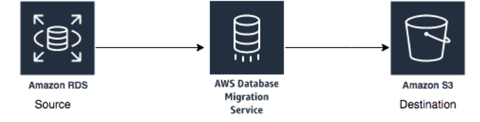

# Lake formation workshop

**NOTE: Please make sure the Postgres database is fully populated before proceed with the DMS lab. It takes 15 to 20 minutes to finish, after the stack is launched.**

- [Lake formation workshop](#lake-formation-workshop)
  - [Lab 1: Database Migration Service](#lab-1-database-migration-service)
    - [Introduction](#introduction)
    - [Changing the RDS Security Group](#changing-the-rds-security-group)
    - [Exploring the setup](#exploring-the-setup)
    - [Explore the database using AWS Lambda](#explore-the-database-using-aws-lambda)
    - [Main Lab](#main-lab)
    - [Generate and Replicate the CDC data](#generate-and-replicate-the-cdc-data)
  - [Lab 2: Lake Formation Workshop](#lab-2-lake-formation-workshop)

## Lab 1: Database Migration Service

### Introduction

This lab will give you an understanding of the AWS Database Migration Service (AWS DMS). You will migrate data from an existing Amazon Relational Database Service (Amazon RDS) Postgres database to an Amazon Simple Storage Service (Amazon S3) bucket that you create.

 

In this lab you will complete the following tasks:

1. Create a subnet group within the DMS Lab VPC
2. Create a DMS replication instance
3. Create a source endpoint
4. Create a target endpoint
5. Create a task to perform the initial migration of the data.
6. Add ongoing replication of data changes on the source: (Only one of the DMS replication instances will enable this feature.)
7. Create target endpoint for CDC files to place these files in a separate location than the initial load files
8. Create a task to perform the ongoing replication of data changes

### Changing the RDS Security Group

Currently your RDS source end point is not open to connect to outside world for security reason. You need to open RDS security group to accept traffic from intended range of IP address. As it is difficult to determine range of IP address of workshop environment, so to have smooth experience of running lab you can temporally allow inbound traffic from all IP address (0.0.0.0/0 CIDR range).

Follow below steps to open security group to connect with source RDS data base for DMS full data and CDC data dump:
1. Go to the RDS and double click on “dmslabinstance” DB identifier as shown below:

 

2. Click VPC security groups under Connectivity & security tab as shown below:

 

3. In Security group screen, Go to Inbound tab and click on Edit as shown below:

 

4. Update Inbound rule to “Anywhere” from hard coded value “72.21.196.67/32” , as shown in below screen.

 

5. Click on Save and now everyone will be able to connect to source RDS instance for lab purpose to ingest data using DMS endpoint.

 

### Exploring the setup

The RDS Postgres database has already been created and populated for you. Go to the CloudFormation service and inspect the resources tab. 

 

The infrastructure that has been created for this workshop looks like this: 

Go to the Outputs tab of AWS CloudFormation stack and note down the instance Endpoint information for your RDS endpoint, which will be similar to information shown in below screenshot:
 

### Explore the database using AWS Lambda

To avoid having to install a SQL Workbench locally, you can use the lambda function. 
1. Find the lambda function named GenerateCDCData
2. Find the line that start with 'var query_cmd = ... 
3. insert your sql statment here

First, run the following query: 
`SELECT * FROM pg_catalog.pg_tables;`

Then ensure the following 2 functions exists. If anything is missing, check the solution at Troubleshoot section.

`SELECT * FROM pg_stat_user_functions WHERE funcname in ('generateticketactivity','generatetransferactivity')`

Use the following query to inspect the player table:

`select * from dms_sample.player;`

### Main Lab 

Follow the instructions provided at: 

https://aws-dataengineering-day.workshop.aws/en/400/430-main-lab.html

Note: At a point the instructions says ‘g. Select the security group with dms-lab-subnet-grp in the name‘. However, the security group is named 
like so 'mod-xxxxxxxxxxxxxxxx-sgrdslaunchwizard2-xxxxxxxxxxxxx'

### Generate and Replicate the CDC data

Once the full table load - DMS lab is completed, you can start to generate extra transactions in source database to demonstrate DMS CDC (Change Data Capture) functionality. Navigate to Lambda console and you will see a pre-built Lambda function named “GenerateCDCData”.

 

Click on the function and scroll down. You will see the code for this function. Copy the below query and paste it in the placeholder (value) of this code line: 

`var query_cmd= ""`

Run this query first: 

`select dms_sample.generateticketactivity(10);`

 

This query will generate 10 ticket sales in batches of 1-6 tickets to randomly selected people for a random price (within a range.) A record of each transaction is recorded in the ticket_purchase_hist table.

Click on Save and then click on Test to run the function. You can create an empty event as shown here:

 

You shouldn't see any errors in the Lambda log:

 

Once you’ve sold some tickets you can run the generateTransferActivity procedure. The following will transfer tickets from the owner to another person. The whole “batch” of tickets purchased is transferred 80% of the time and 20% of the time an individual ticket is transferred.

Run this query next in the lambda function: 

`select dms_sample.generatetransferactivity(10)`;

## Lab 2: Lake Formation Workshop

Follow the instructions provided at: https://aws-dataengineering-day.workshop.aws/en/1200/sagemaker.html.
