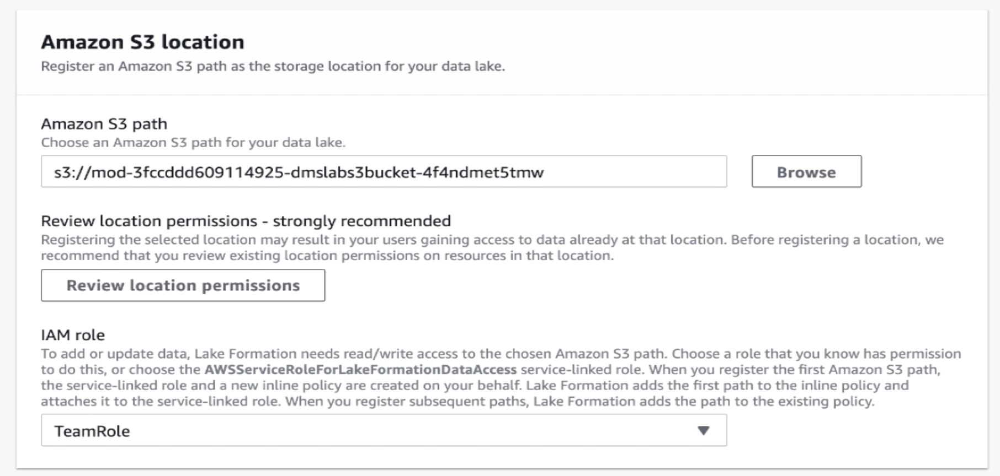
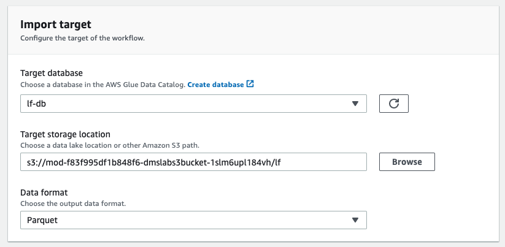

# Lake formation workshop

**NOTE: Please make sure the Postgres database is fully populated before proceed with the DMS lab. It takes 15 to 20 minutes to finish, after the stack is launched.**

- [Lake formation workshop](#lake-formation-workshop)
  - [Lab 1: Database Migration Service](#lab-1-database-migration-service)
    - [Introduction](#introduction)
    - [Changing the RDS Security Group](#changing-the-rds-security-group)
    - [Exploring the setup](#exploring-the-setup)
    - [Explore the database using AWS Lambda](#explore-the-database-using-aws-lambda)
    - [Main Lab](#main-lab)
    - [Generate and Replicate the CDC data](#generate-and-replicate-the-cdc-data)
  - [Lab 2: Lake Formation Workshop](#lab-2-lake-formation-workshop)
    - [Add Administrators](#add-administrators)
    - [Setup the data lake](#setup-the-data-lake)
      - [Register your S3 locations](#register-your-s3-locations)
      - [Create a database](#create-a-database)
      - [Grant permissions](#grant-permissions)
    - [Hydrate the datalake](#hydrate-the-datalake)
      - [Create an S3 VPC endpoint](#create-an-s3-vpc-endpoint)
      - [Create Glue JDBC connection for RDS](#create-glue-jdbc-connection-for-rds)
      - [Using blueprints](#using-blueprints)
      - [Exploring the components of a blueprint](#exploring-the-components-of-a-blueprint)
    - [Interacting with the data lake](#interacting-with-the-data-lake)
      - [Exploring the data lake with Athena](#exploring-the-data-lake-with-athena)
      - [Grant fine grained access controls to data lake user](#grant-fine-grained-access-controls-to-data-lake-user)
      - [Verify data permissions using Athena](#verify-data-permissions-using-athena)
  - [Feedback](#feedback)

## Lab 1: Database Migration Service

### Introduction

This lab will give you an understanding of the AWS Database Migration Service (AWS DMS). You will migrate data from an existing Amazon Relational Database Service (Amazon RDS) Postgres database to an Amazon Simple Storage Service (Amazon S3) bucket that you create.

 

In this lab you will complete the following tasks:

1. Create a subnet group within the DMS Lab VPC
2. Create a DMS replication instance
3. Create a source endpoint
4. Create a target endpoint
5. Create a task to perform the initial migration of the data.
6. Add ongoing replication of data changes on the source: (Only one of the DMS replication instances will enable this feature.)
7. Create target endpoint for CDC files to place these files in a separate location than the initial load files
8. Create a task to perform the ongoing replication of data changes

### Changing the RDS Security Group

Currently your RDS source end point is not open to connect to outside world for security reason. You need to open RDS security group to accept traffic from intended range of IP address. As it is difficult to determine range of IP address of workshop environment, so to have smooth experience of running lab you can temporally allow inbound traffic from all IP address (0.0.0.0/0 CIDR range).

Follow below steps to open security group to connect with source RDS data base for DMS full data and CDC data dump:
1. Go to the RDS and double click on “dmslabinstance” DB identifier as shown below:

 

2. Click VPC security groups under Connectivity & security tab as shown below:

 

3. In Security group screen, Go to Inbound tab and click on Edit as shown below:

 

4. Update Inbound rule to “Anywhere” from hard coded value “72.21.196.67/32” , as shown in below screen.

 

5. Click on Save and now everyone will be able to connect to source RDS instance for lab purpose to ingest data using DMS endpoint.

 

### Exploring the setup

The RDS Postgres database has already been created and populated for you. Go to the CloudFormation service and inspect the resources tab. 

 

The infrastructure that has been created for this workshop looks like this: 

Go to the Outputs tab of AWS CloudFormation stack and note down the instance Endpoint information for your RDS endpoint, which will be similar to information shown in below screenshot:
 

### Explore the database using AWS Lambda

To avoid having to install a SQL Workbench locally, you can use the lambda function. 
1. Find the lambda function named GenerateCDCData
2. Find the line that start with 'var query_cmd = ... 
3. insert your sql statment here, like so: 
 

4. Save the changes to the function by clicking 'Save' in the top right corner
5. Click the 'Test' button next to the 'Save' button
6. You can create an empty event as shown here:

 

First, run the following query: 
`SELECT * FROM pg_catalog.pg_tables;`

Then ensure the following 2 functions exists. If anything is missing, check the solution at Troubleshoot section.

`SELECT * FROM pg_stat_user_functions WHERE funcname in ('generateticketactivity','generatetransferactivity')`

Use the following query to inspect the player table:

`select * from dms_sample.player;`

### Main Lab 

Follow the instructions provided at: 

https://aws-dataengineering-day.workshop.aws/en/400/430-main-lab.html

Note: At a point the instructions says ‘g. Select the security group with dms-lab-subnet-grp in the name‘. However, the security group is named 
like so 'mod-xxxxxxxxxxxxxxxx-sgrdslaunchwizard2-xxxxxxxxxxxxx'

### Generate and Replicate the CDC data

Once the full table load - DMS lab is completed, you can start to generate extra transactions in source database to demonstrate DMS CDC (Change Data Capture) functionality. Navigate to Lambda console and you will see a pre-built Lambda function named “GenerateCDCData”.

 

Click on the function and scroll down. You will see the code for this function. Copy the below query and paste it in the placeholder (value) of this code line: 

`var query_cmd= ""`

Run this query first: 

`select dms_sample.generateticketactivity(10);`

 

This query will generate 10 ticket sales in batches of 1-6 tickets to randomly selected people for a random price (within a range.) A record of each transaction is recorded in the ticket_purchase_hist table.

Click on Save and then click on Test to run the function. You can create an empty event as shown here:

 

You shouldn't see any errors in the Lambda log:

 

Once you’ve sold some tickets you can run the generateTransferActivity procedure. The following will transfer tickets from the owner to another person. The whole “batch” of tickets purchased is transferred 80% of the time and 20% of the time an individual ticket is transferred.

Run this query next in the lambda function: 

`select dms_sample.generatetransferactivity(10)`;

## Lab 2: Lake Formation Workshop

### Add Administrators

Navigate to the AWS Lake Formation service.

1. If you are logging into the lake formation console for the first time then you must add administrators first in order to do that follow Steps 2 and 3. Else skip to Step 4.

2. Click Add administrators

3. Add the `TeamRole` and `LakeFormationWorkflowRole` as a Lake Formation Administrator and Click Save

### Setup the data lake

#### Register your S3 locations

Navigate to the Dashboard and click Register location.

Under the Amazon S3 path, browse to the location of the `dmslabs3bucket` and select the `TeamRole` as the IAM Role.

#### Create a database

Navigate to the Dashboard and click Create database.

Enter `lf-db` as the database name.

For location, choose the `dmslabs3bucket` and add the `lf` prefix at the end.

Your location should look like below:

Then click `Create database`. 

#### Grant permissions

Navigate to Databases on left pane. Select `lf-db` and click on `Actions`, then select `Grant` to grant permissions.

Under `IAM Users and Roles`, select the `LakeFormationWorkflowRole`. Grant “super” permissions for Database permissions and Grantable permissions.

### Hydrate the datalake

#### Create an S3 VPC endpoint

 Navigate to VPC Dashboard and select Endpoints from left section. Click on “Create Endpoint”.

 
 

 In the next window, input the following details:
1. Service Category: AWS Services
2. Service name: com.amazonaws.us-east-1.s3
3. VPC: same as VPC for RDS instance ( It has the description `DMSLabSourceDB`)
4. Route table: in accordance to subnets
5. Policy: Full Access
6. Click on Create Endpoint

#### Create Glue JDBC connection for RDS

1. On the AWS Glue menu, select Connections.

2. Click Add Connection.
3. Enter the connection name. This name should be descriptive and easily recognized (e.g ,`glue-rds-connection`).
4. Choose RDS for connection type and PostgreSQL for Database Engine 
5. Optionally, enter the description. This should also be descriptive and easily recognized and Click Next.

6. Choose `dmslabinstance` as Instance and enter password – “master123” and Click Next and Click Finish.

7. glue-rds-connection was created successfully. To test it, select the connection, and choose Test connection.

#### Using blueprints

Navigate to the Lake Formation service. 

On the left pane navigate to Blueprints and click Use blueprints.

For Blueprint Type, select Database snapshot. 
 
Under Import Source:
1. For Database Connection choose the DB connection created in the glue. [Ex: `glue-rds-connection`] 
2. For Source Data Path enter `sportstickets/dms_sample/player`.

Under Import target:
1. For Target Database, choose “lf-db”. 
2. The target storage location will be prepopulated
3. For Data Format choose Parquet

5. For Import Frequency, Select Run On Demand 

For Import Options:
1. Give a suitable Workflow Name such as `rds-import-workflow`
2. For the IAM role choose the `LakeFormationWorkflowRole` provided 
3. For Table prefix type `lakeformation_`
4. Leave other options as default

Click Create, and wait for the console to report that the workflow was successfully created.

Once the blueprint gets created, click on `Start it now?`. 

**NOTE: There may be a delay of 5-10s delay in the blueprint showing up. You may have to hit refresh. Select the blueprint and choose Start in Actions drop down** 

Once the workflow starts executing, you will see the status changes from `RUNNING` to `DISCOVERING`.

#### Exploring the components of a blueprint

The Lake Formation blueprint creates a Glue Workflow under the hood which contains Glue ETL jobs – both python shell and pyspark; Glue crawlers and triggers. It will take somewhere between 15-20 mins to finish execution. In the meantime, let us drill down to see what it creates for us.

1. On the Lake Formation console, in the navigation pane, choose Blueprints
2. In the Workflow section, click on the Workflow name. This will direct you to the Workflow run page. Click on the Run Id.

3. Here you can see the graphical representation of the Glue workflow built by the Lake Formation blueprint. Highlighting and clicking on individual components will display the details of those components (name, description, job run id, start time, execution time)

4. To understand what Glue Jobs got created as a part of this workflow, in the navigation pane, click on Jobs.
5. Every job comes with history, details, script and metrics tab. Review each of these tabs for any of the python shell or pyspark jobs.

### Interacting with the data lake

#### Exploring the data lake with Athena

1. Navigate to the Lake Formation console.

2. Navigate to Databases on the left panel and select `lf_db`.

3. Click on `Tables in lf_db` and then select the `lakeformation__sportstickets_dms_sample_player` table

4. Click Action -> View data

5. This will now take you to Athena console, where you can preview the table contents, as show below:

#### Grant fine grained access controls to data lake user

An users `BusinessAnalystUser` has already been created for you in the lab, with the password `master123`.
 
Navigate to the Lake Formation console and in the navigation pane, under Permissions, choose Data permissions.

Choose Grant, and in the Grant permissions dialog box, do the following: 
1. For IAM user and roles, choose `BusinessAnalystUser`. 
2. For Database, choose `lf_db` 
3. The Table list populates. 
4. For Table, choose the table shown. 
5. For Columns, select Include Columns and choose `id`, `first_name`
6. For Table permissions, choose Select.

#### Verify data permissions using Athena

Using Athena, let us now explore the data set as the  `BusinessAnalystUser`.

1. Sign in to AWS account with account ID and username as the  `BusinessAnalystUser` user – datalake_user (username:  `BusinessAnalystUser`)

2. Navigate to Amazon Athena console.
3. Before you run your first Athena query, you need to set up a query result location in Amazon S3. On the right side of the Athena console, click on Settings and type in the S3 bucket location. The entry should look something like this: `s3://athenaqueryresults-/`
4. Next, ensure database `lf_db` database is selected.
5. Now run a Select query on the table within the `lf_db` database. There should be only one table in there, which was created by Lake Formation workflow.
6. You will see that the `BusinessAnalystUser` can only see the columns id, first_name in the select query result. The `BusinessAnalystUser` cannot see last_name, sports_team_id, full_name columns in the table. This is because, datalake administrator gave `BusinessAnalystUser` permissions to only select from table for the id and first_name columns.

## Feedback

Please rate this workshop by following the link below:
https://survey.immersionday.com/GxPEp5vGR
